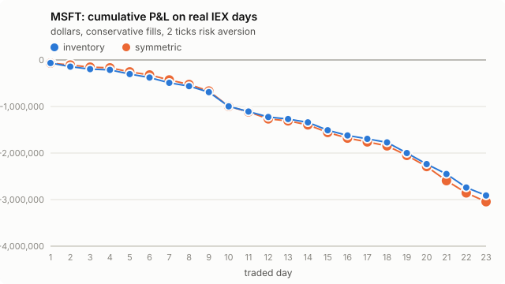

# MSFT: Avellaneda-Stoikov on real IEX data, day by day

- Traded days: 29 (2026-10-02 to 2026-11-12)
- Calibration-only days: 2; days without IEX data: 0

- IEX only: Alpaca's free plan carries the IEX exchange's own quotes and trades, a few percent of US volume. The strategy is simulated as if it quoted on IEX alone.
- No queue position: IEX data has the best bid and ask, not the order-by-order book. The conservative rule fills a quote only on a trade through its price; the optimistic rule also on a trade at it. The truth lies between the two.
- Calibrated on earlier days only (up to five). The first day of each stock only calibrates.
- P&L is in dollars, one lot of 100 shares per side, 30-minute windows that each start and end flat at the mid, before fees and rebates.

## Headline

Inventory strategy, risk aversion 2 ticks per lot.

- **conservative**: mean daily P&L -126364.76 [-156773.16, -98396.25] dollars (negative); 0 of 29 days positive; 4814 fills a day; 5 s markout -61.417 [-74.000, -51.064] ticks per fill (negative is against us).
- **optimistic**: mean daily P&L -126937.47 [-157612.72, -98896.15] dollars (negative); 0 of 29 days positive; 4985 fills a day; 5 s markout -59.949 [-72.556, -49.544] ticks per fill (negative is against us).

## Every setting

Mean over days, 95% bootstrap interval over days in brackets.

| rule | strategy | risk aversion (ticks) | daily P&L ($) | verdict | positive days | fills/day | 5 s markout (ticks) |
|---|---|---|---|---|---|---|---|
| conservative | inventory | 1 | -127937.23 [-159095.00, -99828.08] | negative | 0/29 | 4732 | -61.576 [-74.390, -50.891] |
| conservative | symmetric | 1 | -131106.91 [-164674.05, -99340.47] | negative | 0/29 | 4623 | -61.283 [-74.296, -50.604] |
| conservative | inventory | 2 | -126364.76 [-156773.16, -98396.25] | negative | 0/29 | 4814 | -61.417 [-74.000, -51.064] |
| conservative | symmetric | 2 | -130647.78 [-164259.38, -98818.54] | negative | 0/29 | 4590 | -61.547 [-74.569, -50.852] |
| conservative | inventory | 4 | -122295.16 [-151886.08, -94747.18] | negative | 0/29 | 4825 | -62.151 [-74.861, -51.766] |
| conservative | symmetric | 4 | -129960.19 [-163389.95, -98145.03] | negative | 0/29 | 4525 | -62.100 [-75.135, -51.261] |
| optimistic | inventory | 1 | -128713.19 [-159871.12, -100400.99] | negative | 0/29 | 4907 | -59.976 [-72.703, -49.418] |
| optimistic | symmetric | 1 | -131776.66 [-165344.93, -100160.21] | negative | 0/29 | 4792 | -59.679 [-72.385, -49.170] |
| optimistic | inventory | 2 | -126937.47 [-157612.72, -98896.15] | negative | 0/29 | 4985 | -59.949 [-72.556, -49.544] |
| optimistic | symmetric | 2 | -131283.51 [-164836.14, -99763.37] | negative | 0/29 | 4753 | -60.021 [-72.754, -49.519] |
| optimistic | inventory | 4 | -122840.13 [-152656.58, -95256.28] | negative | 0/29 | 4998 | -60.675 [-73.239, -50.470] |
| optimistic | symmetric | 4 | -130615.50 [-164096.31, -99096.13] | negative | 0/29 | 4681 | -60.686 [-73.572, -50.062] |

## Does inventory control help?

Daily P&L of the inventory strategy minus the symmetric one, paired by day.

| rule | risk aversion (ticks) | inventory minus symmetric ($/day) | verdict |
|---|---|---|---|
| conservative | 1 | 3169.68 [-3911.97, 10386.08] | not established |
| conservative | 2 | 4283.02 [-4937.65, 14021.07] | not established |
| conservative | 4 | 7665.03 [-2869.26, 18853.48] | not established |
| optimistic | 1 | 3063.47 [-4318.21, 10589.36] | not established |
| optimistic | 2 | 4346.04 [-4796.57, 14047.50] | not established |
| optimistic | 4 | 7775.37 [-2661.04, 18884.86] | not established |

## Day by day

Inventory strategy at 2 ticks.

| date | sigma ($/sqrt s) | A / k (conservative) | P&L conservative ($) | P&L optimistic ($) | fills (cons.) | 5 s markout (ticks, cons.) | IEX data |
|---|---|---|---|---|---|---|---|
| 2026-10-01 | calibration only |  |  |  |  |  | no earlier day to calibrate on; this day only calibrates |
| 2026-10-02 | 0.09188 | 0.1438 / 7.8 | -65274.53 | -65888.49 | 2452 | -75.700 | 100% quoted, 13763 trades |
| 2026-10-05 | 0.12604 | 0.1347 / 8.9 | -79396.69 | -80419.49 | 4148 | -41.324 | 100% quoted, 16740 trades |
| 2026-10-06 | 0.11589 | 0.1348 / 9.1 | -52361.15 | -51868.89 | 4397 | -33.239 | 100% quoted, 13695 trades |
| 2026-10-07 | 0.10694 | 0.1325 / 8.9 | -16941.47 | -17240.57 | 2370 | -29.213 | 100% quoted, 13278 trades |
| 2026-10-08 | 0.09814 | 0.1282 / 9.5 | -89481.54 | -90269.51 | 3660 | -53.834 | 100% quoted, 17122 trades |
| 2026-10-09 | 0.11259 | 0.1277 / 9.8 | -75181.24 | -75637.03 | 3752 | -44.122 | 100% quoted, 12668 trades |
| 2026-10-12 | 0.11763 | 0.1272 / 9.6 | -113648.16 | -114515.77 | 3508 | -77.494 | 100% quoted, 12123 trades |
| 2026-10-13 | calibration only |  |  |  |  |  | no earlier day to calibrate on; this day only calibrates |
| 2026-10-14 | 0.13651 | 0.1311 / 8.8 | -69596.52 | -69191.59 | 4345 | -42.767 | 100% quoted, 19532 trades |
| 2026-10-15 | 0.14547 | 0.1440 / 8.5 | -129653.63 | -129815.96 | 4768 | -43.605 | 100% quoted, 13232 trades |
| 2026-10-16 | 0.14607 | 0.1387 / 7.6 | -304716.82 | -304893.28 | 6729 | -73.847 | 100% quoted, 17571 trades |
| 2026-10-19 | 0.17502 | 0.1457 / 6.6 | -111791.66 | -111739.96 | 5452 | -42.922 | 100% quoted, 13924 trades |
| 2026-10-20 | 0.16547 | 0.1530 / 6.2 | -116555.06 | -116739.68 | 4135 | -36.905 | 100% quoted, 9975 trades |
| 2026-10-21 | 0.17516 | 0.1369 / 5.5 | -44263.54 | -44228.99 | 3663 | -34.778 | 100% quoted, 10191 trades |
| 2026-10-22 | 0.17922 | 0.1220 / 4.2 | -71692.00 | -71831.55 | 5312 | -30.329 | 100% quoted, 16194 trades |
| 2026-10-23 | 0.17294 | 0.1301 / 4.3 | -170271.54 | -170360.20 | 3705 | -70.328 | 100% quoted, 11728 trades |
| 2026-10-26 | 0.15766 | 0.1219 / 4.4 | -111991.52 | -112232.53 | 5068 | -47.914 | 100% quoted, 15140 trades |
| 2026-10-27 | 0.16665 | 0.1211 / 4.1 | -71920.07 | -71868.73 | 3214 | -60.372 | 100% quoted, 12940 trades |
| 2026-10-28 | 0.16607 | 0.1255 / 5.0 | -77289.88 | -77398.54 | 4709 | -50.572 | 100% quoted, 20210 trades |
| 2026-10-29 | 0.16483 | 0.1436 / 5.9 | -228691.03 | -230438.36 | 9416 | -41.140 | 100% quoted, 26085 trades |
| 2026-10-30 | 0.16610 | 0.1508 / 5.3 | -236930.34 | -238485.83 | 7757 | -60.530 | 100% quoted, 22289 trades |
| 2026-11-02 | 0.17587 | 0.1638 / 4.8 | -213774.08 | -214981.01 | 6481 | -68.289 | 100% quoted, 21236 trades |
| 2026-11-03 | 0.17789 | 0.1685 / 4.6 | -289788.58 | -290776.71 | 4728 | -167.134 | 100% quoted, 21070 trades |
| 2026-11-04 | 0.25177 | 0.1814 / 4.9 | -170576.85 | -171138.72 | 7509 | -67.500 | 100% quoted, 36246 trades |
| 2026-11-05 | 0.25532 | 0.1943 / 4.5 | -317181.76 | -318012.39 | 8369 | -108.458 | 100% quoted, 35897 trades |
| 2026-11-06 | 0.27693 | 0.2128 / 5.1 | -168076.57 | -169699.00 | 3973 | -158.776 | 100% quoted, 20695 trades |
| 2026-11-09 | 0.28227 | 0.2084 / 5.8 | -44599.32 | -44083.31 | 2182 | -57.656 | 100% quoted, 19217 trades |
| 2026-11-10 | 0.27299 | 0.2066 / 7.1 | -77452.08 | -77383.12 | 4656 | -49.732 | 100% quoted, 22631 trades |
| 2026-11-11 | 0.20065 | 0.2051 / 6.9 | -78191.47 | -82311.30 | 5271 | -52.877 | 100% quoted, 24540 trades |
| 2026-11-12 | 0.19325 | 0.1913 / 7.4 | -67288.92 | -67736.27 | 3888 | -59.738 | 100% quoted, 16796 trades |
